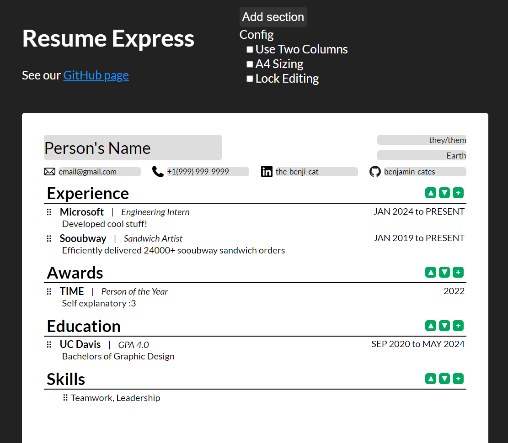

#  Resume Express

Resume Express is a tool to allow you to quickly edit a resume so it is customized to each job application while maintaining good formatting.
## Features
- Save and load as JSON
- Export to LaTeX
- Consistent formatting
- Easy reordering and substitution



## Development mode
To run in development mode, run the following commands assuming `npm` is installed on your computer.
```bash
git clone https://github.com/benjamin-cates/resume_express
cd resume_express
npm install
npm run dev
```
The webapp is built with React and can all run locally without a backend.

